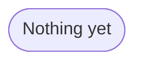

## Clone repo
```
git clone https://github.com/RdlphESTP/chatbotUI.git
```

## Build environnement with uv
```
uv sync
```

## Configure .env
Copy `.env.example` to `.env` :

```
cp .env.example .env
```

Fill in the environment variables :

* **`LLM_API_KEY`**

* **`VLM_API_KEY`**

* **`SSL_CERTIFICATE`**

* `EMBEDDING_API_KEY`

You can also extend the list of models. Remember to add them in `src/chatbotui/config.py` with the following syntax :
```
new_model_info=os.getenv("NEW_MODEL_INFO")
```

## Start the web app
```
uv run chainlit run app.py
```

---

## Project structure

