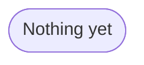

## Clone repo
```
git clone git@github.com:RdlphESTP/chatbotui.git
```

## Build environnement with uv
```
uv venv --python 3.12
uv sync
```

## Configure .env
Copy `.env.example` to `.env` :

```
cp .env.example .env
```

Fill in your API keys :

- **`OPENAI_API_KEY :`** for the LLM,

- **`ROBOFLOW_API_KEY :`** for the VLM,

- **`ZSCALER_CERT :`** SSL certificate if needed,

- `GEMINI_API_KEY` : for OCR (optional).


## Start the web app

```
uv run chainlit run app.py
```

---

## Project structure


